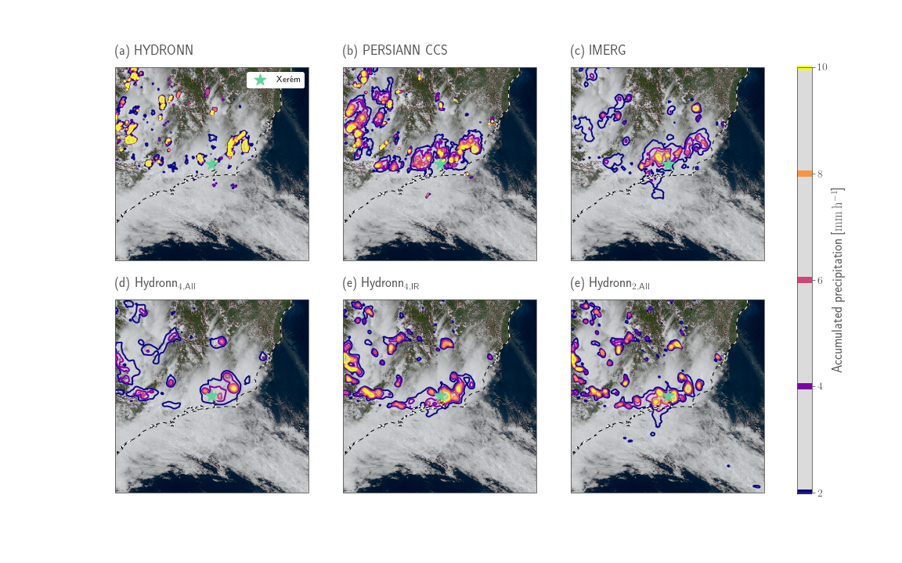

# HYDRONN

This repository contains the code for the production and evaluation of the Hydronn near real-time precipitation retrieval for Brazil. The neural-network based algorithm retrieves precipitation from GOES 16 imagery. It is trained using co-locations of GOES observations and the GPM combined retrieval.

## Overview

This repository contains the ``hydronn`` Python package, which implements the basic funcitonality to create the co-locations, train the retrieval and evaluate it. The ``notebook`` folder
contains Jupyter notebooks that implement the data analysis for the accompanying study. The ``script`` folder contains executable script for training and inference.

## Example

The image below shows retrieved precipitation from 3 reference retrieval
products and three different configuration of Hydronn. The scene shows an
extreme precipitation event that occurred in Duque de Caxias in December 2020
(green star). While the three reference retrieval all misplace the precipitation
too far north, the Hydronn retrievals correctly identify the precipitation
over the affected region.

